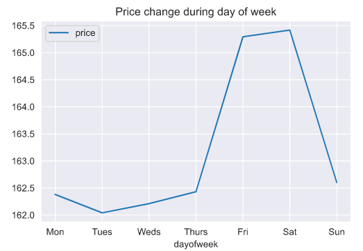
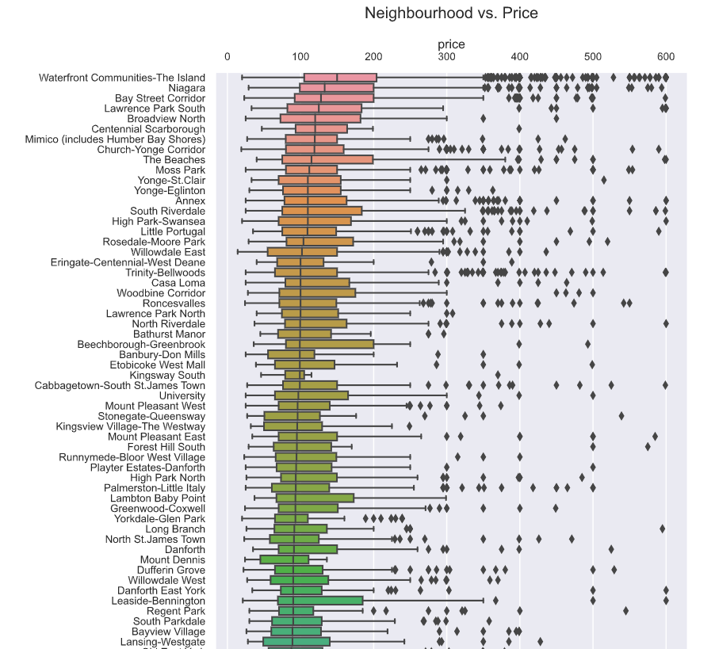

# Airbnb-Price-Prediction
Airbnb Listings, EDA and Prediction: Toronto, Canada

Airbnb 2021 data was sourced from: http://insideairbnb.com/get-the-data.html

# Task:

1. Explore Airbnb calendars data
2. Explore Airbnb listings data
3. Predict listing prices (Random Forest and LightGBM)

# Jupiter Notebook:
https://github.com/trajceskijovan/Airbnb-Price-Prediction/blob/main/Airbnb%20Listing%20Toronto.ipynb

# Insights Summary:

